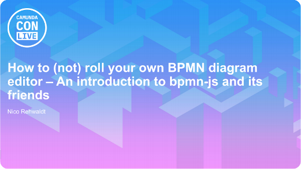

# bpmn-js: Roll your own BPMN editor

Material for my talk "How to (not) roll your own BPMN editor" I gave at CamundaCon LIVE 2020.

## Slides

## Demo

[__:arrow_right: Try it out__](https://cdn.statically.io/gh/nikku/roll-your-own-bpmn-editor/v0.0.4/public/index.html).

Checkout [`./public`](./public) for the source code of the working, final result.

## Demo Sketch

* Open editor
* Show HTML demo skeleton (basic BPMN diagram being displayed)
* Add file import and download
* Introduce services aka modeler.get(‘canvas’).zoom(‘fit-viewport’)
* Introduce extension mechanism aka additionalModules
* Disable rendering (override bpmnRenderer)
* Add [minimap](https://github.com/bpmn-io/diagram-js-minimap)
* Add [linting](https://github.com/bpmn-io/bpmn-js-bpmnlint) + lint rules
* Enable [service task only](./service-task-only) modeling

## License

MIT
